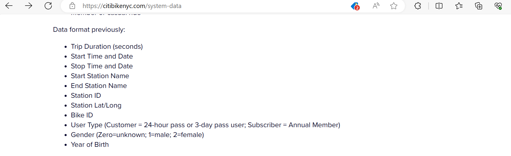

```{r setup, include=FALSE}
knitr::opts_chunk$set(echo = TRUE)
library(tidyverse)
library(gvlma)
library(psych)
library(GGally)
library(openintro)
library(flextable)
library(summarytools)
library(infer)
library(epiDisplay)
library(sjPlot)
library(reactable)
library(bigrquery)
library(gmodels)
library(dplyr)
library(readr)
library(plyr)
library(purrr)
library(statsr)
library(gridExtra)
library(patchwork)
library(scales)
library(gapminder)

projectid = "data-607-project"
```

## Abstract

Citi Bike is the largest bike share program in the United States, that New York City Launched in May 2013. For this assignment I used Citi Bike data public data that has been cross referenced with census data. My goal is to find the relationship between Annual membership and casual membership, and what type of bike they rented more whether is classic or electric.
The system's high ridership and use are largely due to Citi Bike's station density and linkage to public transportation hubs. Seventy-four percent of Citi Bike stations are located five minutes' walk from the entrance to a subway station. The biggest problems facing the system are growing and diversifying its clientele and adjusting the quantity of bicycles accessible at stations with high demand. Despite serving a small physical region, Citi Bike has grown to be an essential component of New York's transportation culture.

## Introduction {.tabset}

Users can ride rented bicycles from one bike station to another with the use of public bike sharing. Over the past four years, there has been an upsurge in the number of bike share programs in the US. Citibike data are being upload to the [@citibike-site] every month and each data set is divided into month.

- Citi Bike is the nation's largest bike share program.
- Over 20,000 bikes and over 1,300 stations across Manhattan, Brooklyn, Queens, the Bronx.
- More stations bikes are being added all over the New York city within walking distance of the train stations.
-   All trip data is publicly available.
For this assignment I will be using Citibike data from Public data set to explore the data. [@citibike-site] to show relationship between type bike among their membership types and to predict if it is safe for people to continue rented bike. I will be looking at measure or ways the city protects the riders from cars.

### Data Import

I will be importing the citi bike data that I have downloaded through the city bike cite [@citibike-site] and preview only the header of the data. The data has been assembled from a number of sources. In the beginning of the citi bike program data were reported a specific ways until 2018 Citibike have change their data format. 

```{r -loading data}
# load Data

CitiBike <- read.csv("202401-citibike-tripdata_1.csv", na = c(" "))

reactable(head(CitiBike))
```

### Data format representation

Below are two different sample pictures and each sample picture represent the format of the Citi Bike data representation. In the beginning of the program in 2013, user data were reported as follow in the old format below then in 2018 user data were reported differently which is in the current format below.

Old Format

Data representation in the beginning of the program through 2018.



Current Format

The new format data representation as 2018 until now.


By looking at both format above we can see that some riders information were removed from Citi Bike public data such as User Type (Customer = 24-hour pass or 3-day pass user; Subscriber = Annual Member), Gender (Zero=unknown; 1=male; 2=female), Year of Birth.


### Data Tidy

Since my data set is a categorical data, in order for me to be able to to test my hypothesis or ran any test I need to convert it to factor then numeric. The unclass assign value 1, 2 to each group base on their value for example by looking at each header below you will see their levels. 

```{r}
# CitiBike as factor

head((CitiBike$member_casual = as.factor(CitiBike$member_casual)))
head((CitiBike$rideable_type = as.factor(CitiBike$rideable_type)))
head((CitiBike$ride_id = as.factor(CitiBike$ride_id)))
CitiBike_new1 <- CitiBike %>%
  mutate(unclass(CitiBike$rideable_type))
CitiBike_new <- CitiBike_new1 %>%
  mutate(unclass(CitiBike_new1$member_casual))


```

## Data Filter by membership {.tabset}

For this section I will be filtering the data base on the membership, and each membership will consist of two different group of rideable type.

```{r}
## filter by membership

 
Annual_member <- CitiBike %>% filter(member_casual == "member")

Casual_member <- CitiBike %>% filter(member_casual == "casual")
```

### Classic_bike vs Electric_bike by Percentage

The graph below show percentage of bike rented by each type of members. We can see from the member have a higher percentage of bike rental for electric bike and classic bike.

```{r,warning=FALSE,echo=FALSE}
## Percentage of bike rental

membership <- factor(c("casual", "member", "casual", "member"))

myplot <- ggplot(CitiBike, aes(member_casual, group = rideable_type)) +
          geom_text(aes( label = scales::percent(..prop..),
                   y= ..prop.. ), stat= "count", vjust = -.5) +
          geom_bar(aes(y = ..prop.., fill = factor(..membership..)), stat="count") + 
          scale_y_continuous(labels=scales::percent) +
          ylab("Percentage of bike rental") +
          xlab("membership type") +
          facet_grid(~rideable_type)
myplot
```

### number of bikes rented by membership

The graph below show the amounts of bike rented by each type of members. We can see from the member have a greater amount of bike rental for electric bike and classic bike.

```{r,warning=FALSE,echo=FALSE}
## Number of Bike rented

ggplot(CitiBike, aes(x = member_casual, fill = factor(..membership..)), 
       stat = "count") +
   geom_text(aes( label = scales::stat(..count..),
                   y= ..count.. ), stat= "count", vjust = -.5) +
  geom_bar(binwidth = 3000) +
  ylab("Number of bike rented by rideable type") +
  xlab("membership type") +
   facet_wrap(~rideable_type)
```

### Proportion of rideable_type

For this part I want to look at the total of ride able type available for the members. We can there is a Total of 1000000 bikes available for both type, from that total only 361979 is classic bike and the rest is electric.

```{r,prop-table-Rideable_type,warning=FALSE,echo=FALSE}
## Proportion of rideable type

tab1(CitiBike$rideable_type, sort.group = "decreasing", cum.percent = F)
```

### Proportion of membership

For this part I want to look at the proportion members that are subscribe for bike rental either its annual or casual members. We can there is a Total of 1000000 members since there are 1000000 bike available. The data show that there are more regular member than casual member.

```{r, warning=FALSE,echo=FALSE}
## Proportion of membership

tab1(CitiBike$member_casual,sort.group = "decreasing", cum.percent = F ) 
```

### membership type

This is a graph of regular member compare to casual member. It shows that there are more member compare to casual member.

```{r,warning=FALSE,echo=FALSE}
## Plot of number of members by type.

ggplot(CitiBike, aes(x = member_casual, fill = member_casual, 
  stat = "count")) + 
  geom_text(aes( label = scales::stat(..count..),
                   y= ..count.. ), stat= "count", vjust = -.5) +
  geom_bar(binwidth = 3000) +
  ylab("Number of members") +
  xlab("membership type") 
```

## Inference : Hypothesis {.tabset}

### Hypothesis Testing

\(H_0\): Annual and casual members tend to rent classic bike rather than electric bike. However, annual subscribers have a higher percentage of classic bike rented than casual subscribers.

\(H_A \): There is a relationship between the classic bike rented by annual subscribers and casual subscribers. The same relationship exist between electric bike and the type of renters.

### Chi-square test: Chi-square test of independence

Since my data set containing two or more categorical variables in order  to evaluates or test whether there is an association between the categories of the two variables I will be performing a chi-square test. Chi-square statistics is used to investigate whether distributions of categorical variables differ from one another. I will be using four different methods of Chi-square test to test my hypothesis, then plot the Chi-square test result to better visualize which can possibly lead to future questions.

### Chi-square: Method 1 

This is the first method that I will be using to test my null hypothesis. Base on the result we can see that p-value is less than 0.001, we can also conclude that the expected frequencies from the chi-square test method is higher compare to Proportion of rideable_type and Proportion of membership above.

```{r -Method-1}
## Methode 1

Chi_result <- chisq.test(table(CitiBike_new$rideable_type, CitiBike_new$member_casual))

Chi_result

Chi_result$expected # expected frequencies
Chi_result$p.value # p-value

```

### Chi-square: Method 2

For the second method we still have the same expected p=value of 0 with a chi-square of 7613.

```{r -Method-2}
# second method:
summary(table(CitiBike_new$rideable_type, CitiBike_new$member_casual))
```

### Chi-square: Method 3

For this method I will be looking at the associate stats using the chi-square test, we see the likelihood ration along with some coefficient values.

```{r -Method-3}
# third method:
library(vcd)

assocstats(table(CitiBike_new$rideable_type, CitiBike_new$member_casual))

```

### Chi-square: Method 4

For the four method I used the summary tools along with dplyr library to analyze both variables from the citi Bike data. This method provide a table output that display the number along with the percentage.

```{r -Method-4}
library(summarytools)
library(dplyr)

# fourth method:
CitiBike_new %$%
  ctable(rideable_type, member_casual,
    prop = "r", chisq = TRUE, headings = FALSE
  ) %>%
  print(
    method = "render",
    style = "rmarkdown",
    footnote = NA
  )
```

### Combination of plot and statistical test

**Chi-Square Plot 1**

This plot shows the Pearson residuals value for membership bike type along with the p-value.

```{r}
library(vcd)
## Chi-square Plot # 1 

mosaic(~ rideable_type + member_casual,
  direction = c("v", "h"),
  data = CitiBike_new,
  shade = TRUE
)
```

The mosaic function has the advantage that it combines a mosaic plot (to visualize a contingency table) and the result of the Chi-square test of independence. As you can see, the mosaic plot is similar to the barplot presented above, but the p-value of the Chi-square test is also displayed at the bottom right.
Moreover, this mosaic plot with colored cases shows where the observed frequencies deviates from the expected frequencies if the variables were independent. The red cases means that the observed frequencies are smaller than the expected frequencies, whereas the blue cases means that the observed frequencies are larger than the expected frequencies.

**Chi-Square Plot 2**

From the plot, it seems that regular members are more likely to lean toward classic bike, while casual members tend to lean toward electric bike. We can say that bike type and membership type are thus expected to be dependent.

This is confirmed thanks to the statistical results displayed in the subtitle of the plot. There are several results, but we can in this case focus on the p-value which is displayed after p = at the top (in the subtitle of the plot).

```{r}
# load packages
library(ggstatsplot)
library(ggplot2)

## Chi-square Plot # 2
ggbarstats(
  data = CitiBike_new,
  x = member_casual,
  y = rideable_type
) +
  labs(caption = NULL) # remove caption
```


## Conclusion and interpretation

From the output and from Chi_result$p.value we see that the p-value is less than the significance level of 5%. Like any other statistical test, if the p-value is less than the significance level, we can reject the null hypothesis.
⇒In our context, rejecting the null hypothesis for the Chi-square test of independence means that there is a significant relationship between the type of bikes and membership type. Therefore, knowing the value of one variable helps to predict the value of the other variable.

Even though the data show shows there's a higher percentage of classic bike rented by annual compare to casual subscribers, but I'm not sure that's really the case because they could be a lot of factor that affect this data, for Example the data are report by months. The data set that was using was for the month of February 2024 only maybe that percentage could be that month only. As with the previous tests, we reject the null hypothesis and we conclude that species and size are dependent (p-value < 0.001).


## References

1. System Data. (2014). Citi Bike. http://www.citibikenyc.com/system-data
2. NYC Department of Transportation. (2013). NYC Bike Share: Designed by New Yorkers. http://www.nyc.gov/html/dot/downloads/pdf/bike-share-outreach-report.pdf
3.  Citi Bike System Data.
